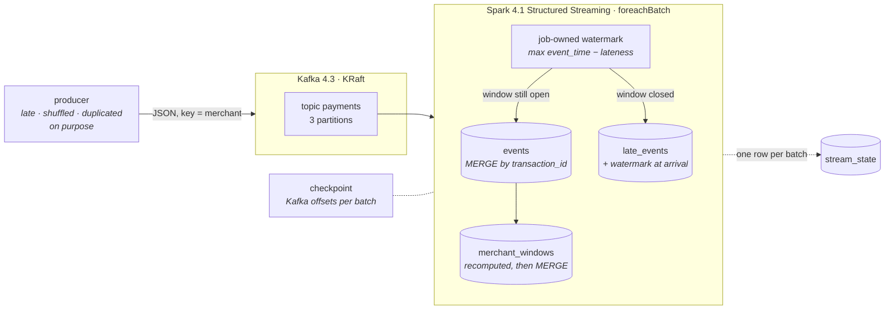

# Foz

### The river arrives when it arrives. The ledger still balances.

A payments stream on Kafka and Spark Structured Streaming whose Delta destination
stays correct when records arrive late, out of order, twice, or after the job
was killed halfway through a batch.

<p>
  <a href="https://github.com/kabianca/foz-payments-stream/actions/workflows/tests.yml">
    
  </a>
  
  
  
  
  
</p>

**English** · [Português](README.pt-BR.md)

---

## Why I built this

Every Kafka demo shows a message going in and coming out. None of them answer
the two questions that actually decide whether a streaming pipeline can be
trusted with money:

1. What happens to the record that shows up after its window has closed?
2. When the job dies in the middle of a batch and comes back, does the
   destination end up with the row twice?

I have worked with Kafka in a payments context, and the conversations that
mattered were never about throughput. They were about these two questions, and
about the phrase "exactly-once". It is not a property of the broker. It is a property of the
**destination**: a key, and a write that converges when repeated.

So this repository is small on purpose and hostile on purpose. The producer
injects lateness, disorder and duplicates deliberately, because a producer that
only emits well-behaved events proves nothing. The job is built so that every
decision it makes is a property you can check on the tables afterwards, and
there is a script that kills the Spark JVM mid-batch and then checks them.

The name is the mouth of a river. Everything the project argues about happens
at the point of arrival.

---

## Architecture



Four Delta tables, all path-based, all written by `MERGE`:

| table              | one row per            | what it proves                                                     |
|--------------------|------------------------|--------------------------------------------------------------------|
| `events`           | transaction            | the record landed once, in the window its `event_time` says        |
| `late_events`      | late transaction       | the record was refused, when, and against which watermark          |
| `merchant_windows` | (window, merchant)     | totals equal a fresh recount of `events`; final windows never move |
| `stream_state`     | micro-batch            | what the job decided each batch: watermark in, watermark out, counts |

---

## Design decisions

This is the section I would want to read first as a reviewer.

### Late data is routed, not dropped

Spark's built-in `withWatermark` is the right default for a framework and the
wrong default for a ledger: a row that arrives after the watermark is dropped
and a counter goes up. The row is gone. Nobody downstream can tell a merchant
"this transaction was refused at 14:03 because its window closed at 14:01".

Foz keeps the same rule Spark applies to windowed aggregations and owns it
inside `foreachBatch`:

```
watermark(N)  = max(event_time seen through batch N) − allowed_lateness
late in N+1   = window_end ≤ watermark(N)
```

A window closes when the watermark passes its end. A record whose window is
closed goes to `late_events` with the watermark it lost to and how far behind it
was. A record whose window is still open goes in, even if its `event_time` is
older than the watermark itself: that is exactly what Spark does, and the test
`test_event_older_than_watermark_but_in_an_open_window_is_on_time` pins it.

The threshold every batch is judged against is the one the *previous* batch
produced and persisted in `stream_state`. That detail is what makes a replayed
batch classify its rows exactly as the first attempt did.

### Exactly-once is a property of the destination

Kafka delivers to Spark at least once. The checkpoint guarantees that a batch
interrupted mid-way is handed to `foreachBatch` again with the same offsets. So
the whole question is what the sink does the second time. Three rules:

- **Every write is a `MERGE` by key.** `events` and `late_events` by
  `transaction_id` (first arrival wins, so a duplicate is a no-op, not an
  update). `merchant_windows` by (window, merchant). `stream_state` by
  `batch_id`.
- **Totals are derived, never accumulated.** A batch does not add its counts to
  a window; it recomputes every window it touched from `events` and upserts
  the result. Adding twice doubles; recomputing twice converges.
- **The batch ledger counts stamped rows, not merge metrics.** `rows_on_time`
  for batch N is the number of rows in `events` carrying `batch_id = N`. On a
  replay the `MERGE` inserts nothing, but the rows the first attempt inserted
  still carry the stamp, so the ledger stays true whichever write the crash
  landed after.

`tests/test_idempotency.py` crashes the batch after each of its four writes,
replays it, and asserts all seven invariants from `foz/check.py` hold.

### The checkpoint decides what a batch is; the tables decide what it means

The checkpoint holds Kafka offsets, nothing else. No aggregate state lives in
it, so it can be deleted and the tables are still right; it cannot be deleted
without reprocessing from `earliest`, which is exactly the trade the tables are
built to absorb. `test_restart_resumes_from_the_checkpoint_without_reprocessing_or_skipping`
drives the real `start_query` from a file source and restarts it.

### Two clocks, both persisted

`event_time` is when the payment happened, set by the producer. It is the only
clock that decides the window and the watermark. `processing_time` is when this
job saw the record, stamped once per batch. `kafka_timestamp` sits between them.
All three are columns on every row of `events` and `late_events`. Confusing the
first two is the classic bug: a job that windows on processing time reports
perfect numbers and a wrong ledger.

### Out of order inside the window is not a special case

Because totals are recomputed from `events`, the order in which records arrive
within a window cannot change the final aggregate. `tests/test_ordering.py`
runs the same events sorted, shuffled and reversed, in one batch and in seven,
and asserts the windows are identical, as long as the disorder stays within
the lateness budget.

### A window closes once

`merchant_windows.is_final` flips when the watermark passes `window_end`, and
the row never changes again: anything that arrives for it afterwards is late by
definition and goes to `late_events`. A consumer that reads only final windows
gets numbers that will not move under its feet.

### The producer misbehaves on purpose

`foz/producer.py` is deterministic under a seed and has a knob for each kind of
bad behaviour: jitter (every event is a few seconds behind the clock), shuffle
(events leave in scrambled groups), late (stamped past the closed window) and
duplicate (a previous event re-sent byte for byte, the way a retry would).
`make produce LATE=0.3 DUP=0.1` is a different stream, not a different job.

### Malformed input stops the job

A payload without `transaction_id` or `event_time` cannot be windowed and
cannot be keyed. The batch raises `MalformedBatchError` and the job stops. That
is the loud option; the silent one, dropping the row, is the failure mode this
whole project exists to refuse. Kafka offset loss is treated the same way
(`failOnDataLoss=true`).

### Money never touches a float

`amount` is a decimal string on the wire and `DECIMAL(18,2)` in every table.

### One laptop

Kafka runs with a 512 MB heap; Spark runs `local[2]` with a 1 GB driver. The
Delta and Kafka connector jars are resolved at image build time and copied onto
the classpath, so a restart of the job needs no network. The tests need neither
Kafka nor Docker: `process_batch` is a function of a DataFrame and what is on
disk, and the checkpoint test drives the real query from a file source.

---

## Running it

You need Docker, Docker Compose and, for the tests and the checks, Python 3.12+
with Java 17+.

```bash
make init          # .env with your uid, data folders
make up            # Kafka (KRaft) + the streaming job
make produce       # 300 events, 10% late, 5% duplicated, shuffled
make status        # table sizes and the last batches
make kill          # kill -9 the Spark JVM; Docker restarts it
make produce SEED=2
make check         # every invariant over the Delta tables
```

`make help` lists everything. The window is one minute and the lateness budget
two minutes by default (`.env`).

### Proving it in two minutes

```bash
make prove
```

produces a misbehaving stream, waits for it to land, produces another one while
killing the driver mid-batch, waits for the restart to finish the job, and then
runs the checks:

```
== 5/5 invariants
✔ ledger matches tables                                rows_in=800 = events 709 + late 58 + duplicates 33
✔ one row per transaction                              duplicates in events=0, in late_events=0, in both=0
✔ windows equal a fresh recount of events              16 windows, 0 disagree with events
✔ every late row arrived after its window closed       58 late rows, 0 without a closed window at arrival
✔ watermark never moves backwards                      5 batches, 0 break(s) in the chain
✔ final windows never changed again                    6 final, 0 received events after closing, 0 should be closed
✔ event time and processing time are different clocks  709 rows, 0 with equal clocks, 0 processed before the broker saw them

7/7 invariants hold
```

The first batch after a cold start has no watermark, so the "late" events the
producer injects in its first seconds land as on-time. That is Spark's behaviour
too, and the ledger shows it rather than hiding it.

---

## Layout

```
foz/
  batch.py       process_batch: one micro-batch → four tables. The argument lives here.
  stream.py      Kafka source, wire-format parsing, foreachBatch wiring, entrypoint
  producer.py    deterministic misbehaving producer (CLI)
  check.py       the seven invariants, `--status`, `--wait-for-rows`
  schema.py      wire schema and the four table schemas
  tables.py      Delta tables by path
  config.py      settings from the environment
  spark.py       SparkSession factory
tests/           pytest, no Kafka, no Docker
docker/          stream (Spark + Delta + Kafka jars) and producer images
scripts/prove.sh the end-to-end argument
```

---

## Tests

```bash
make test
```

| file                      | proves                                                                                                  |
|---------------------------|---------------------------------------------------------------------------------------------------------|
| `test_watermark.py`       | within the budget lands in the right window; past the closed window is quarantined with evidence; the watermark never regresses; a window closes once; malformed input stops the batch |
| `test_idempotency.py`     | replaying a batch changes nothing; crashing after any of the four writes and replaying converges; duplicates within and across batches are absorbed; invariants hold under random replays |
| `test_ordering.py`        | shuffled, reversed and differently batched arrivals produce identical windows                          |
| `test_two_clocks.py`      | both clocks persisted; window and watermark come from `event_time`, never from processing time         |
| `test_stream.py`          | the wire format parses; the real query resumes from its checkpoint without reprocessing or skipping    |
| `test_producer.py`        | same seed, same stream; late is late enough; duplicates are exact copies; shuffle disorders             |

CI runs the suite on every push and pull request with Spark 4.1, Delta 4.4 and
Java 17.

---

## Where this grows

- **Malformed payloads to a dead-letter topic** instead of stopping the job,
  once there is a schema registry to say what "malformed" means.
- **Per-key watermarks.** The threshold is global, like Spark's. A merchant
  whose terminal is offline for an hour will have every record refused when it
  reconnects; a per-merchant watermark would accept them. That is a product
  decision about how long a window may stay open, and it belongs to someone
  with a merchant on the phone.
- **Compaction and vacuum.** Every batch produces small files in four tables.
  `OPTIMIZE` on a schedule and `VACUUM` with a retention that respects the
  replay window.
- **Reprocessing late events.** `late_events` is a queue as much as an audit
  table; a batch job that re-opens a window and folds them in is the natural
  next step, and it needs a rule for who may see a total that changed.

## What I would do differently in production

- The stream would not be the thing that recomputes windows from the events
  table forever. Past a certain size the recompute is bounded by partitioning
  `events` on `window_start` date; past a larger size it moves to a
  `transformWithState` processor with the totals in the state store and the
  events table as the audit copy.
- `stream_state` is read at the start of every batch. In production it would be
  cached in the driver and read from disk only on restart.
- Object storage instead of a bind mount, and a real Delta log compaction
  schedule.
- One consumer group, `local[2]`, one node. Foz is an argument about
  correctness; it says nothing about scale, and it should not pretend to.
