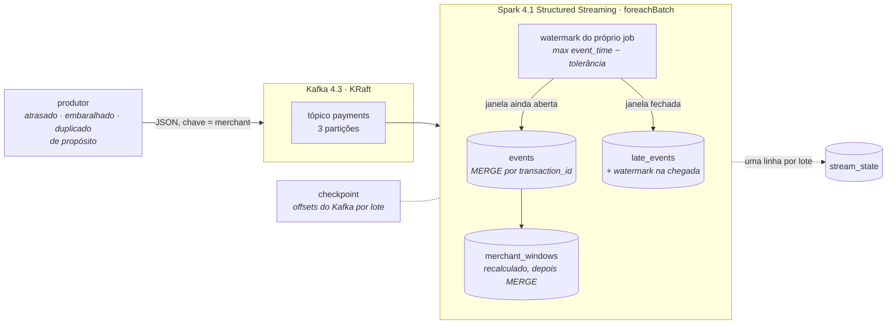

# Foz

### O rio chega quando chega. As contas continuam fechando.

Um fluxo de pagamentos em Kafka e Spark Structured Streaming cujo destino em
Delta continua correto quando os registros chegam atrasados, fora de ordem, em
duplicidade ou depois de o job ter sido morto no meio de um lote.

<p>
  <a href="https://github.com/kabianca/foz-payments-stream/actions/workflows/tests.yml">
    
  </a>
  
  
  
  
  
</p>

[English](README.md) · **Português**

---

## Por que construí isto

Toda demo de Kafka mostra uma mensagem entrando e saindo. Nenhuma responde às
duas perguntas que de fato decidem se um pipeline de streaming pode cuidar de
dinheiro:

1. O que acontece com o registro que aparece depois que a janela dele fechou?
2. Quando o job morre no meio de um lote e volta, o destino fica com a linha
   duas vezes?

Trabalhei com Kafka em contexto de pagamentos e as conversas que importavam
nunca eram sobre throughput. Eram sobre essas duas perguntas e sobre a
expressão "exactly-once". Não é uma propriedade do broker. É uma propriedade do
**destino**: uma chave e uma escrita que converge quando repetida.

Por isso este repositório é pequeno de propósito, mas, a meu  ver, grande em propósito. O
produtor injeta atraso, desordem e duplicatas deliberadamente, porque um
produtor que só emite eventos bem-comportados não prova nada. O job é construído
de modo que cada decisão que ele toma seja uma propriedade verificável nas
tabelas depois e há um script que mata o JVM do Spark no meio de um lote e
então as verifica.

O nome é a foz de um rio. Tudo o que o projeto defende acontece no ponto de
chegada.

---

## Arquitetura



Quatro tabelas Delta, todas por caminho, todas escritas com `MERGE`:

| tabela             | uma linha por          | o que prova                                                              |
|--------------------|------------------------|--------------------------------------------------------------------------|
| `events`           | transação              | o registro entrou uma vez, na janela que o `event_time` dele diz         |
| `late_events`      | transação atrasada     | o registro foi recusado, quando, e contra qual watermark                 |
| `merchant_windows` | (janela, merchant)     | os totais batem com uma recontagem de `events`; janela final não se move |
| `stream_state`     | micro-lote             | o que o job decidiu em cada lote: watermark de entrada, de saída, contagens |

---

## Decisões de projeto

Esta é a seção que eu gostaria de ler primeiro como pessoa revisora.

### Dado atrasado é roteado, não descartado

O `withWatermark` nativo do Spark é o padrão certo para um framework e o
padrão errado para um razão: a linha que chega depois do watermark é descartada
e um contador sobe. A linha se foi. Ninguém a jusante consegue dizer a um
lojista "esta transação foi recusada às 14:03 porque a janela dela fechou às
14:01".

O Foz mantém a mesma regra que o Spark aplica a agregações por janela e a
assume dentro do `foreachBatch`:

```
watermark(N)      = max(event_time visto até o lote N) − tolerância
atrasado em N+1   = window_end ≤ watermark(N)
```

Uma janela fecha quando o watermark passa do fim dela. Um registro cuja janela
está fechada vai para `late_events` com o watermark para o qual perdeu e a
distância em segundos. Um registro cuja janela ainda está aberta entra, mesmo
que seu `event_time` seja mais antigo que o próprio watermark: é exatamente o
que o Spark faz, e o teste
`test_event_older_than_watermark_but_in_an_open_window_is_on_time` fixa isso.

O limiar contra o qual cada lote é julgado é o que o lote *anterior* produziu
e persistiu em `stream_state`. Esse detalhe é o que faz um lote reprocessado
classificar suas linhas exatamente como na primeira tentativa.

### Exactly-once é uma propriedade do destino

O Kafka entrega ao Spark pelo menos uma vez. O checkpoint garante que um lote
interrompido no meio é entregue ao `foreachBatch` de novo com os mesmos
offsets. Então a pergunta inteira é o que o destino faz da segunda vez. Três
regras:

- **Toda escrita é um `MERGE` por chave.** `events` e `late_events` por
  `transaction_id` (a primeira chegada vence, então uma duplicata é no-op, não
  update). `merchant_windows` por (janela, merchant). `stream_state` por
  `batch_id`.
- **Totais são derivados, nunca acumulados.** Um lote não soma suas contagens a
  uma janela; ele recalcula toda janela que tocou a partir de `events` e faz
  upsert do resultado. Somar duas vezes dobra; recalcular duas vezes converge.
- **O razão de lotes conta linhas carimbadas, não métricas do merge.**
  `rows_on_time` do lote N é o número de linhas em `events` com
  `batch_id = N`. Num replay o `MERGE` não insere nada, mas as linhas que a
  primeira tentativa inseriu ainda carregam o carimbo, então o razão continua
  verdadeiro seja qual for a escrita depois da qual a falha aconteceu.

`tests/test_idempotency.py` derruba o lote depois de cada uma das quatro
escritas, reprocessa, e afirma que os sete invariantes de `foz/check.py`
valem.

### O checkpoint decide o que é um lote; as tabelas decidem o que ele significa

O checkpoint guarda offsets do Kafka, nada mais. Nenhum estado de agregação vive
nele, então ele pode ser apagado e as tabelas continuam certas; ele não pode ser
apagado sem reprocessar desde `earliest`, que é exatamente a troca que as
tabelas foram feitas para absorver.
`test_restart_resumes_from_the_checkpoint_without_reprocessing_or_skipping`
dirige o `start_query` real a partir de uma fonte em arquivo e o reinicia.

### Dois relógios, ambos persistidos

`event_time` é quando o pagamento aconteceu, definido pelo produtor. É o único
relógio que decide a janela e o watermark. `processing_time` é quando este job
viu o registro, carimbado uma vez por lote. `kafka_timestamp` fica entre os
dois. Os três são colunas em toda linha de `events` e `late_events`. Confundir
os dois primeiros é o bug clássico: um job que janela por tempo de
processamento reporta números perfeitos e um razão errado.

### Fora de ordem dentro da janela não é caso especial

Como os totais são recalculados a partir de `events`, a ordem em que os
registros chegam dentro de uma janela não pode mudar o agregado final.
`tests/test_ordering.py` roda os mesmos eventos ordenados, embaralhados e
invertidos, em um lote e em sete, e afirma que as janelas são idênticas —
desde que a desordem fique dentro da tolerância de atraso.

### Uma janela fecha uma vez

`merchant_windows.is_final` vira verdadeiro quando o watermark passa de
`window_end`, e a linha nunca mais muda: qualquer coisa que chegue para ela
depois é atrasada por definição e vai para `late_events`. Um consumidor que lê
só janelas finais recebe números que não vão se mover debaixo dos pés dele.

### O produtor se comporta mal de propósito

`foz/producer.py` é determinístico sob uma semente e tem um botão para cada
tipo de mau comportamento: jitter (todo evento fica alguns segundos atrás do
relógio), shuffle (os eventos saem em grupos embaralhados), late (carimbado
depois da janela fechada) e duplicate (um evento anterior reenviado byte a
byte, como faria um retry). `make produce LATE=0.3 DUP=0.1` é um fluxo
diferente, não um job diferente.

### Entrada malformada para o job

Um payload sem `transaction_id` ou `event_time` não pode ser janelado nem
chaveado. O lote levanta `MalformedBatchError` e o job para. Essa é a opção
barulhenta; a silenciosa, descartar a linha, é o modo de falha que este projeto
existe para recusar. Perda de offsets no Kafka é tratada da mesma forma
(`failOnDataLoss=true`).

### Dinheiro nunca passa por float

`amount` é uma string decimal no fio e `DECIMAL(18,2)` em todas as tabelas.

### Um laptop

O Kafka roda com heap de 512 MB; o Spark roda `local[2]` com driver de 1 GB.
Os jars do Delta e do conector Kafka são resolvidos na construção da imagem e
copiados para o classpath, então um reinício do job não precisa de rede. Os
testes não precisam nem de Kafka nem de Docker: `process_batch` é uma função de
um DataFrame e do que está em disco, e o teste de checkpoint dirige a query
real a partir de uma fonte em arquivo.

---

## Rodando

Você precisa de Docker, Docker Compose e, para os testes e as verificações,
Python 3.12+ com Java 17+.

```bash
make init          # .env com seu uid, pastas de dados
make up            # Kafka (KRaft) + o job de streaming
make produce       # 300 eventos, 10% atrasados, 5% duplicados, embaralhados
make status        # tamanho das tabelas e os últimos lotes
make kill          # kill -9 no JVM do Spark; o Docker o reinicia
make produce SEED=2
make check         # todos os invariantes sobre as tabelas Delta
```

`make help` lista tudo. A janela é de um minuto e a tolerância de atraso de
dois minutos por padrão (`.env`).

### Provando em dois minutos

```bash
make prove
```

produz um fluxo mal-comportado, espera ele pousar, produz outro enquanto mata o
driver no meio de um lote, espera o reinício terminar o trabalho, e então roda
as verificações:

```
== 5/5 invariants
✔ ledger matches tables                                rows_in=800 = events 709 + late 58 + duplicates 33
✔ one row per transaction                              duplicates in events=0, in late_events=0, in both=0
✔ windows equal a fresh recount of events              16 windows, 0 disagree with events
✔ every late row arrived after its window closed       58 late rows, 0 without a closed window at arrival
✔ watermark never moves backwards                      5 batches, 0 break(s) in the chain
✔ final windows never changed again                    6 final, 0 received events after closing, 0 should be closed
✔ event time and processing time are different clocks  709 rows, 0 with equal clocks, 0 processed before the broker saw them

7/7 invariants hold
```

O primeiro lote depois de uma partida a frio não tem watermark, então os
eventos "atrasados" que o produtor injeta nos primeiros segundos entram como
pontuais. É o comportamento do Spark também, e o razão mostra isso em vez de
esconder.

---

## Estrutura

```
foz/
  batch.py       process_batch: um micro-lote → quatro tabelas. O argumento mora aqui.
  stream.py      fonte Kafka, parse do formato de fio, ligação do foreachBatch, entrypoint
  producer.py    produtor determinístico e mal-comportado (CLI)
  check.py       os sete invariantes, `--status`, `--wait-for-rows`
  schema.py      schema de fio e os schemas das quatro tabelas
  tables.py      tabelas Delta por caminho
  config.py      configurações a partir do ambiente
  spark.py       fábrica de SparkSession
tests/           pytest, sem Kafka, sem Docker
docker/          imagens do stream (Spark + Delta + jars Kafka) e do produtor
scripts/prove.sh o argumento de ponta a ponta
```

---

## Testes

```bash
make test
```

| arquivo                   | prova                                                                                                   |
|---------------------------|---------------------------------------------------------------------------------------------------------|
| `test_watermark.py`       | dentro da tolerância entra na janela certa; depois da janela fechada vai para a quarentena com evidência; o watermark nunca regride; uma janela fecha uma vez; entrada malformada para o lote |
| `test_idempotency.py`     | reprocessar um lote não muda nada; falhar depois de qualquer uma das quatro escritas e reprocessar converge; duplicatas dentro e entre lotes são absorvidas; invariantes valem sob replays aleatórios |
| `test_ordering.py`        | chegadas embaralhadas, invertidas e loteadas de forma diferente produzem janelas idênticas             |
| `test_two_clocks.py`      | ambos os relógios persistidos; janela e watermark vêm de `event_time`, nunca do tempo de processamento  |
| `test_stream.py`          | o formato de fio é lido; a query real retoma do checkpoint sem reprocessar nem pular                   |
| `test_producer.py`        | mesma semente, mesmo fluxo; atrasado é atrasado o bastante; duplicatas são cópias exatas; shuffle desordena |

O CI roda a suíte a cada push e pull request com Spark 4.1, Delta 4.4 e Java 17.

---

## Para onde isto cresce

- **Payloads malformados para um tópico dead-letter** em vez de parar o job,
  quando houver um schema registry para dizer o que "malformado" significa.
- **Watermark por chave.** O limiar é global, como o do Spark. Um lojista cujo
  terminal fica offline por uma hora terá todos os registros recusados quando
  reconectar; um watermark por lojista os aceitaria. É uma decisão de produto
  sobre quanto tempo uma janela pode ficar aberta, e pertence a quem tem um
  lojista no telefone.
- **Compactação e vacuum.** Cada lote produz arquivos pequenos em quatro
  tabelas. `OPTIMIZE` agendado e `VACUUM` com retenção que respeite a janela
  de replay.
- **Reprocessar os atrasados.** `late_events` é tanto uma fila quanto uma
  tabela de auditoria; um job batch que reabre uma janela e os incorpora é o
  próximo passo natural, e precisa de uma regra sobre quem pode ver um total
  que mudou.

## O que eu faria diferente em produção

- O stream não seria a coisa que recalcula janelas a partir da tabela de
  eventos para sempre. A partir de certo tamanho o recálculo é limitado
  particionando `events` pela data de `window_start`; a partir de um tamanho
  maior ele vai para um processador `transformWithState` com os totais no
  state store e a tabela de eventos como cópia de auditoria.
- `stream_state` é lido no início de cada lote. Em produção ficaria em cache no
  driver e seria lido do disco só no reinício.
- Object storage no lugar de um bind mount, e um cronograma real de compactação
  do log do Delta.
- Um consumer group, `local[2]`, um nó. O Foz é um argumento sobre correção;
  não diz nada sobre escala, e não deveria fingir que diz.
